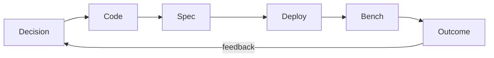
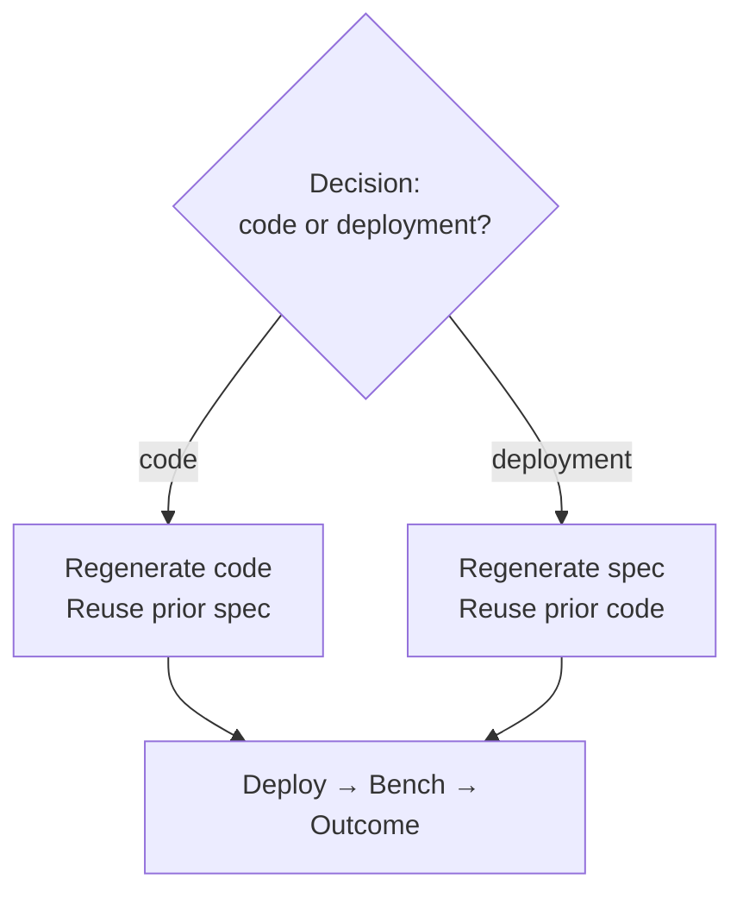

# Iterative Experiment Loop

Draft for Methods §3.3 — **recommended structure for the thesis**.

---

## How to structure this in the thesis

**Put the exclusive code-vs-spec choice in the loop overview (with a figure),**
not only buried under “refinement iterations.”

Readers need that branching rule early. Baseline vs refinement then specialises
the *same* loop (retries, decision skipped, etc.). Deep stage mechanics stay in
§ Phases (decision, code, spec, …).

### Suggested subsection order

1. **Samples, runs, and iterations** — sample = (scenario, framework, model, …);
   one sample can host several K8s experiments under different harness knobs
   (`N`, baseline attempts, LLM cost cap, cluster/load profile); iteration =
   one pipeline pass (`000` baseline, `001`–`N` refinement)
2. **The iteration loop** ← figure + stage blurbs + mutual exclusivity
3. Baseline (000) — both code *and* spec generated; no decision
4. Refinement (001–N) — decision picks one lever
5. Agent memory (conversation + slimming)

---

## Overview (thesis prose target)

Each **experiment** (run under a sample) executes a sequence of **iterations**.
The loop is:

```text
decision → code → spec → deploy → bench (writes feedback on success)
         └──────────────► next iteration
```





**Mutually exclusive:** in refinement, exactly one of code or spec is regenerated.
Deploy / bench always run (feedback is part of successful bench).

---

## Stage one-liners (in the loop section)

| Stage | Role |
|-------|------|
| **Decision** | From last-iteration feedback: improve *code* or *spec* (skip on 000) |
| **Code** | FT-gated app (+ image); regenerate *or* lineage-copy |
| **Spec** | Validated `spec.yaml`; regenerate *or* lineage-copy |
| **Deploy** | Apply + Ready / endpoints |
| **Bench** | Adaptive Locust + diagnostics |
| **Outcome** | Success/fail label + feedback for next round |

---

## Baseline (000)

No decision. Generate **both** code and spec (many retries). Then deploy → bench.

## Refinement (001–N)

Decision → **either** code path **or** deployment path (one LLM attempt) → deploy → bench.

---

## Conversation memory

One `conversation.json` thread per experiment; phases append turns.
Slimming: telemetry in decision; later stages pointer to history.
Artifacts (`iteration_feedback.json`, …) complement the chat.

---

## Cross-references

- Phase details: `04`–`09`
- Failure routing: `10-failure-handling.md`
- LaTeX figure: `fig-iteration-pipeline.tex` (also inlined in draft)
