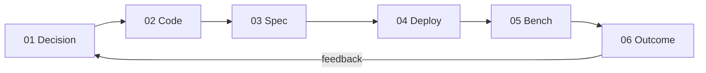

# Suggested Figures & Tables for LaTeX

Checklist of visuals to plan early.

---

## Figures

### Fig. 1 — System architecture (block diagram)

Boxes:

- BaxBench orchestrator (LLM client, Docker, kubectl)
- K8s control plane
- K8s workers (app + DB pods)
- Locust master + workers
- Private registry

Arrows: image push, `kubectl apply`, HTTP load, SSH to Locust hosts.

---

### Fig. 2 — Iteration pipeline (flowchart)

Annotate: “Decision skipped for iteration 000”.

---

### Fig. 3 — Baseline bootstrap (sequence diagram)

Actors: Agent, Framework, K8s, Locust.

Show retry loop on spec validation / deploy probe for baseline only.

---

### Fig. 4 — Goodput trajectory (example Results figure, sketch in Methods)

Line plot: iteration index vs. goodput for one sample.

Reference your actual `plots/goodput_per_iteration.png` outputs.

---

## Tables

### Table 1 — Cluster node roles

| Host | Role | vCPU | RAM |
|------|------|------|-----|
| node0 | control + orchestrator + registry | … | … |
| node3–5 | K8s workers | … | … |
| node1–2 | Locust | … | … |

---

### Table 2 — `spec.yaml` parameters (agent-controlled)

Copy from [06-phase-spec.md](06-phase-spec.md).

---

### Table 3 — Phase inputs and outputs

| Phase | Primary input | Primary output | Retries |
|-------|---------------|----------------|---------|
| Decision | prior feedback | deployment \| code | — |
| Code | scenario / feedback | Docker image | baseline: many |
| Spec | capacity + feedback | spec.yaml | baseline: many |
| Deploy | manifests | ready namespace | — |
| Bench | load profile | metrics + diagnostics | — |
| Outcome | bench artifacts | iteration_feedback.json | — |

---

### Table 4 — Failure routing

Copy from [10-failure-handling.md](10-failure-handling.md).

---

## Naming conventions for thesis

| Concept | Recommended term |
|---------|------------------|
| K8s API server host | control-plane node |
| K8s compute hosts | worker nodes |
| Locust coordinator | load master |
| Locust generators | load workers |
| `iteration-000-baseline` | baseline iteration |
| `iteration-00k-spec` | deployment refinement iteration *k* |
| `iteration-00k-code` | code refinement iteration *k* |
| Agent output YAML | deployment specification (`spec.yaml`) |

Avoid overloaded “master” without qualifier.

---

## LaTeX tips

- Use `\lstinputlisting` or `minted` for short `spec.yaml` excerpts in appendix.
- Full prompts → appendix; Methods summarizes structure only.
- Link to public repo / artifact Zenodo if required by faculty.
