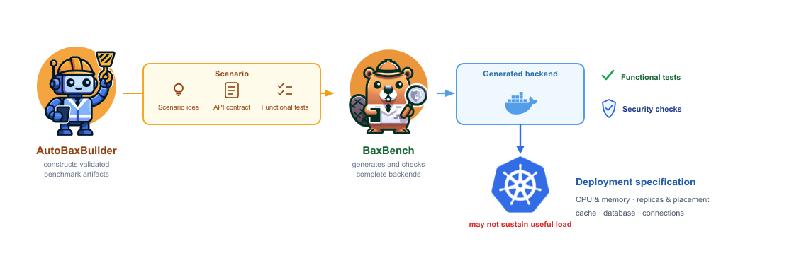

# Background and scope

[IterBench](README.md) asks a practical systems question: after an LLM has
generated a backend application, can a continuing agent improve the service it
delivers under concurrent load when it may revise either the application code
or the Kubernetes deployment?

## From BaxBench to IterBench

[BaxBench](https://arxiv.org/abs/2502.11844) provides the task model: a backend
scenario, API contract, target framework, and checks for whether generated
code behaves correctly. Its normal evaluation is deliberately lightweight and
container-based. Passing that functional gate is useful evidence about the
covered API behaviour, but it does not establish how a replicated service
behaves under sustained concurrent load.

IterBench keeps the BaxBench task format and functional gate, then adds a
Kubernetes deployment and a load-driven refinement loop. The objective is
**sustained goodput**: successful HTTP responses per second at a level the
adaptive controller accepts as stable. It is not a transient ramp peak and it
is not an unlimited-duration capacity guarantee.

| Component | Role in this repository |
| --- | --- |
| **BaxBench** | Upstream scenario/framework task format and functional correctness gate. |
| **AutoBaxBuilder** | The basis for the offline scenario-construction pipeline. |
| **IterBench** | The thesis framework: validated code and deployment lineages, Kubernetes deployment, adaptive load testing, diagnostics, and iterative refinement. |

IterBench is an extension of **BaxBench**. Its offline scenario/workload
pipeline builds on [AutoBaxBuilder](https://arxiv.org/abs/2512.21132); it is
not itself simply an AutoBaxBuilder extension.

## Offline inputs versus evaluated candidates

Before model evaluation, the repository prepares a fixed package for each
scenario: its description, OpenAPI contract, functional tests, and Locust
workload. The adapted AutoBaxBuilder pipeline uses durable conversations and
structured repair evidence, then adds load-test generation and verification.
Reference implementations are calibration targets only; they are never
candidates in the later model evaluation.

AutoBaxBuilder supplies validated scenario inputs; BaxBench generates and checks complete backends; IterBench adds the constrained Kubernetes deployment and sustained-load loop. The figure shows BaxBench's broader functional-and-security-checking context; the reported IterBench evaluation reuses the functional gate, not the security suite.

The pipeline has three stages:

1. Scenario authoring: propose a scenario, admit it through novelty review,
   and validate an OpenAPI contract.
2. Functional-test construction: generate tests and calibrate them against
   multiple reference implementations.
3. Load-test construction: validate the Locust script, verify that every API
   operation receives load, and review weighted execution across the reference
   implementations.

The thesis evaluation reuses the functional gate before Kubernetes
benchmarking. It does not rerun BaxBench's security suite in the deployed
evaluation, and the AutoBaxBuilder security-test construction step is outside
this evaluation pipeline.

## What the agent may change

Each candidate combines two artifacts:

- **Application code**: the backend implementation for a scenario/framework.
- **Deployment specification**: a constrained, schema-validated plan for
  replicas, CPU and memory, placement, connection pooling, database topology,
  cache options, and database tuning.

The framework owns rendering Kubernetes manifests, validation, deployment,
load generation, diagnostics, and artifact lineage. The model proposes code,
the deployment specification, and (after the baseline) which of those two
levers to refine next.

## Scope of the claims

The reported results describe one fixed grid: three models, seven
database-backed scenarios, three technology stacks, one trajectory per task,
and one dedicated cluster topology. They are not population-level model or
framework rankings, and they do not isolate the causal contribution of
runtime feedback, agent memory, or a particular refinement lever. Read the
[evaluation limitations](evaluation.md#reading-the-results) alongside the
headline results.
