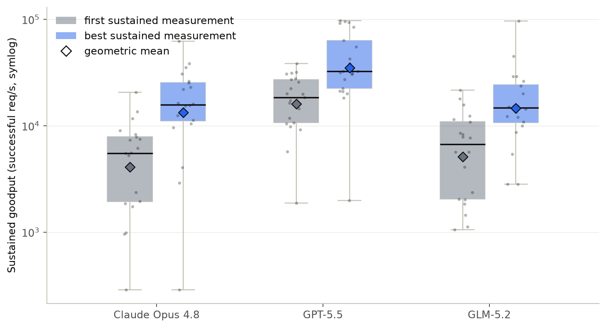
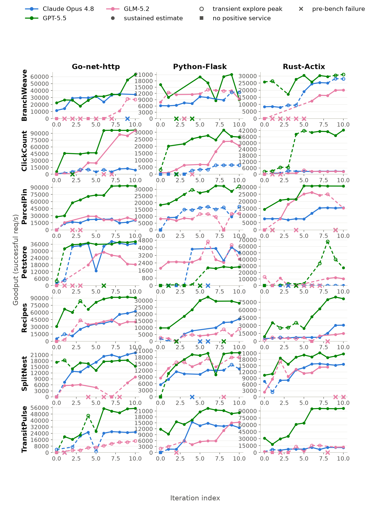
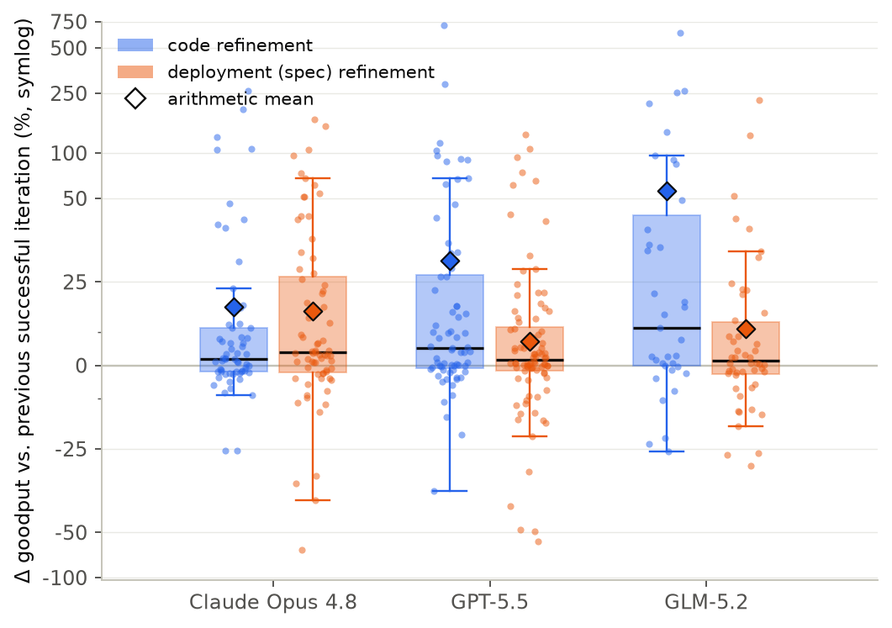
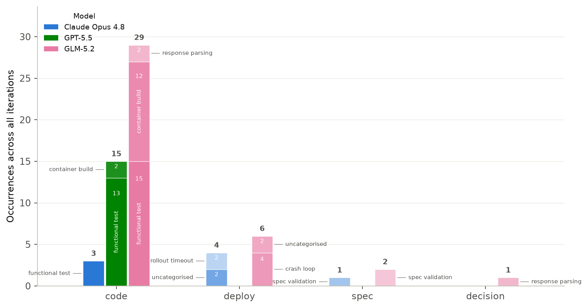

# Evaluation

The final evaluation asks how far the complete IterBench loop can improve
**sustained goodput** under a fixed cluster and iteration budget. This page
summarises the thesis results; the complete candidate record is available in
the [results appendix](results_appendix.md) and the tracked
[aggregate CSVs](README.md#data-and-provenance).

## Experimental setup

### Models and tasks

The evaluated grid crosses three models, seven database-backed scenarios, and
three language/framework stacks: 63 tasks in total. Each task has one sample
and one trajectory: a baseline plus ten refinement iterations.

| Model | Exact evaluated identifier | Provider path / treatment |
| --- | --- | --- |
| Claude Opus 4.8 | `claude-opus-4-8` | Anthropic Messages API with adaptive thinking. |
| GPT-5.5 | `gpt-5.5-2026-04-23` | OpenAI Chat Completions API with high reasoning effort. |
| GLM-5.2 | `z-ai/glm-5.2` | OpenRouter Chat Completions API. |

| Scenario source | Scenarios | API paths / functional tests |
| --- | --- | --- |
| Original BaxBench | ClickCount, Recipes, Petstore | 2/1, 5/1, 8/3 |
| Adapted AutoBaxBuilder pipeline | BranchWeave, ParcelPinLockerPickup, SplitNestSharedExpenseLedger, TransitPulseDelayReporter | 5/5, 6/4, 6/4, 5/3 |

The three evaluated stacks are Go/net-http, Python/Flask, and Rust/Actix.
Model identity includes its provider route and reasoning configuration; the
comparison does not hold those implementation details constant.

### Infrastructure and procedure

Experiments ran sequentially on nine identical Emulab `d430` hosts (32 CPU
cores and about 62.7 GiB RAM each): one control/orchestrator/registry host,
four Kubernetes workers (128 raw cores and about 251 GiB total), and four
dedicated Locust hosts with 112 load-worker processes. Namespace cleanup ran
between candidates so evaluation cells did not share requested cluster
capacity.

The budget is 11 candidates per task (baseline + 10 refinements), giving 693
planned candidates. Of these, 632 reached the benchmark stage and 61 stopped
earlier at a recorded pipeline stage.

## Measurement check

All goodput values use the same Explore-Refine controller described in
[Methods](methods.md#adaptive-load-profile). A fixed candidate was
re-measured to characterise that instrument before interpreting the
optimisation results.

| Check | Observed result | Meaning |
| --- | --- | --- |
| Repeated estimate/no-estimate outcome | 90.4% agreement over 625 candidates (κ = 0.75) | The procedure usually agrees whether Refine establishes a sustained estimate. |
| Repeated positive estimates | 2.9% median symmetric difference over 437 pairs; 90% within 15.7% | Repeated positive values typically differ by a few percent, with a longer tail. |
| Explore vs. Refine | Refine settled below its own Explore peak in 75.8% (about 76%) of 475 comparable runs; it exceeded the peak in 24.2% | The Explore peak is useful diagnostic context, but is not a sustained-goodput estimate or a guaranteed upper bound. |
| Estimate yield | 475 of 632 benchmark runs (75.2%) | No sustained estimate is a distinct outcome, not zero capacity. |
| Run duration | 404 s median; 4 runs hit the 1,800 s cap | The controller normally terminates by its phase criteria. |

## Results

### RQ1: What improvement did the loop find?

For each task that ever establishes a positive sustained estimate, the main
comparison is its first positive estimate against the best sustained estimate
found within the fixed budget.

| Model | Valid tasks | Sustained baseline | First sustained GM | Best sustained GM | GM gain |
| --- | ---: | ---: | ---: | ---: | ---: |
| Claude Opus 4.8 | 20/21 | 12/21 | 4,084 req/s | 13,382 req/s | 3.3× |
| GPT-5.5 | 21/21 | 14/21 | 16,026 req/s | 34,853 req/s | 2.2× |
| GLM-5.2 | 20/21 | 7/21 | 5,138 req/s | 14,560 req/s | 2.8× |

Across the grid, 58 of 61 tasks that ever established a sustained estimate
found a higher candidate; the pooled geometric-mean best-over-first ratio is
**2.7×**. Thirty baselines lacked an estimate, and 28 of those later reached
one. This is a best-achieved result, not terminal reliability: 46 of the 61
tasks finished above their first estimate, 6 finished at or below it, and 9
finished without an estimate (median final/first: 1.98×).

A separate fixed-candidate repeat check supports that result: selected best
candidates re-measured higher in 52 of 56 pairs, tied in 1, and measured lower
in 3. On the 50 positive repeat pairs, the geometric-mean ratio was 2.84×.

The [appendix trajectory grid](results_appendix.md) retains every missing
estimate and pre-benchmark failure. The corresponding visual overview is also
available below.

### RQ2: How did code and deployment refinement differ?

The agent chose each lever adaptively, so these are descriptive observed
profiles rather than randomized causal effects.

| Selected lever | Chosen | Reached bench | Failed before bench | Clean positive-to-positive steps | Median change | GM change |
| --- | ---: | ---: | ---: | ---: | ---: | ---: |
| Code | 328 | 280 | 48 (14.6%) | 164 | +3.9% | +19.2% |
| Deployment spec | 301 | 289 | 12 (4.0%) | 211 | +2.6% | +7.0% |

Code refinement was the riskier route to a measurement, but the completed
clean code steps contained the largest recoveries and positive jumps. The
boundary states matter too: code steps regained a sustained estimate 49 times
and lost one 19 times; deployment steps regained one 18 times and lost one 29
times.

### RQ3: Where did the pipeline stop?

Of 61 recorded pre-benchmark failures, 47 occurred in Code, 10 in Deploy, 3
in Spec, and 1 in Decision. Functional-test failures (31) and container-build
failures (14) account for 45 of 61, or **74%**. Static deployment-spec
validation rejected all three observed resource-infeasible proposals before
they were sent to the cluster.

Several deployment failures reveal code–configuration interactions that an
isolated functional test or a schema-only specification check cannot see. A
completed load test with no sustained estimate is intentionally not counted as
a pipeline failure; it remains an outcome in the appendix and trajectory
figure.

### Cost and stack variation

The accounted LLM spend was $287.73 in total, or $4.57 per 11-candidate task.

| Model | Total spend | Mean per task | Best sustained-goodput GM |
| --- | ---: | ---: | ---: |
| Claude Opus 4.8 | $133.61 | $6.36 | 13,382 req/s |
| GPT-5.5 | $125.63 | $5.98 | 34,853 req/s |
| GLM-5.2 | $28.49 | $1.36 | 14,560 req/s |

Go/net-http had the highest geometric-mean best sustained goodput for every
model in this grid. That comparison describes complete evaluated stacks
(language, framework, server defaults, generated code, and refinement history)
rather than an inherent framework ceiling.

## Reading the results

The results are deliberately bounded:

- One trajectory was collected per task, from a purposive, database-heavy
  scenario set and one cluster topology.
- There is no no-feedback, fresh-context, random-policy, classical-tuner, or
  autoscaling control. The evaluation measures the complete loop, not the
  causal effect of one mechanism.
- The headline comparison selects the best measurement in a fixed budget;
  final outcomes are weaker, as reported above.
- Sustained goodput is controller- and profile-dependent. Successful HTTP
  responses do not prove semantic equivalence when replicas, read routing, or
  caches are introduced.
- Seventeen early cells were re-benchmarked after an experiment-network
  routing fix. Reported measurements use those consistent re-measurements, but
  the earlier feedback remains part of the affected trajectories' history.

For values, joins, and individual outcomes, use the
[aggregate data files](README.md#data-and-provenance) and the
[complete per-iteration appendix](results_appendix.md).
