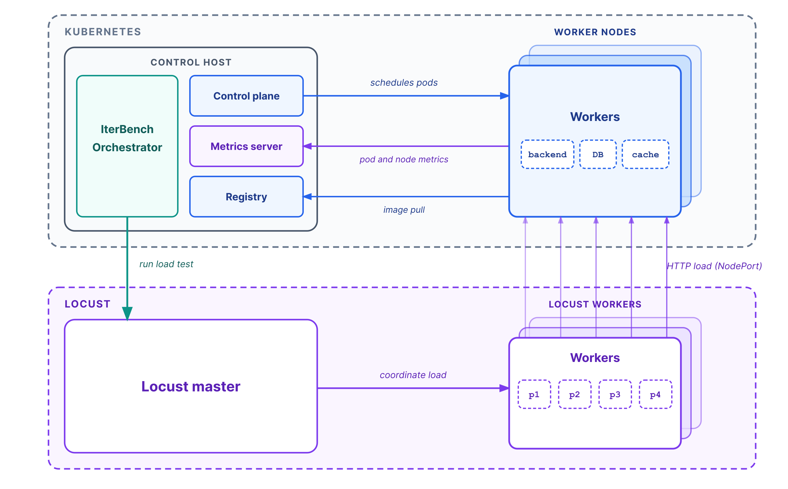
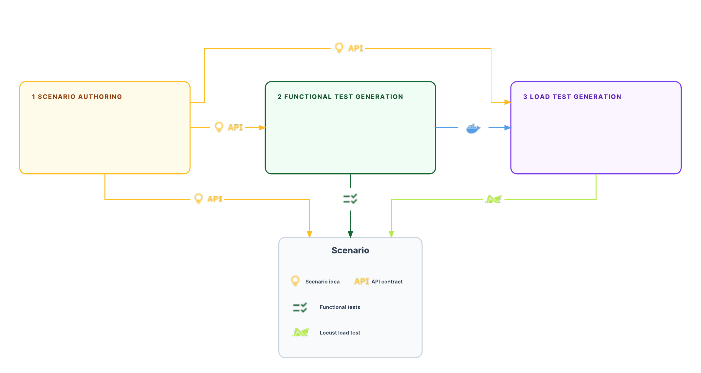
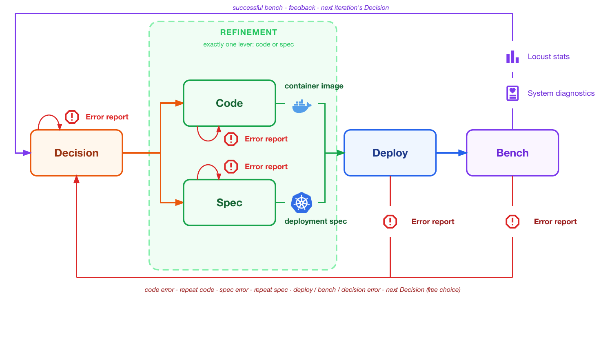
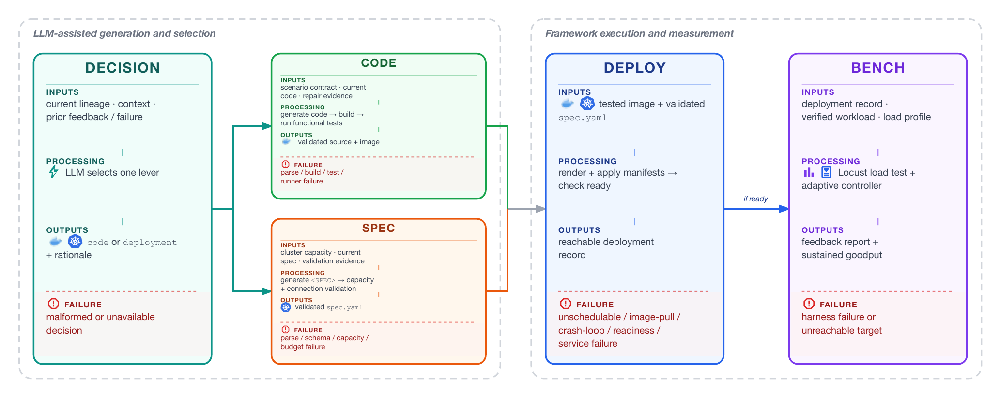
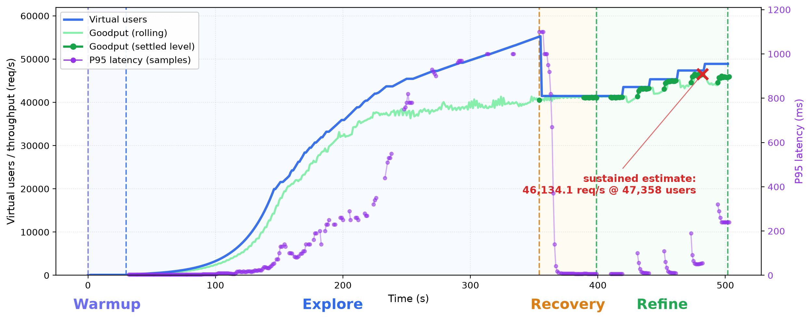

# Methods

This page describes the evaluated IterBench method. For the concrete model
grid, cluster, and budgets, see [Evaluation](evaluation.md#experimental-setup).

## Architecture

The assessed LLM communicates with the IterBench orchestrator. Candidate pods
run on Kubernetes worker nodes; a private registry supplies their images and a
metrics server provides utilisation data. Locust runs from separate hosts, so
the load generators do not compete with the measured deployment for worker
CPU or memory.



Every candidate receives an isolated Kubernetes namespace. Namespace cleanup
before deployment and after each sample avoids competition between evaluated
candidates, while preserving the recorded artifacts on disk.

## Units and artifact lineage

| Term | Meaning |
| --- | --- |
| **Task** | One scenario × framework × model-configuration cell. |
| **Sample** | An independent stochastic trajectory for a task. |
| **Experiment** | A sample with its fixed budget, cluster profile, and load profile. |
| **Iteration** | One candidate pass through the pipeline. Iteration 0 is the baseline. |
| **Candidate** | A validated application image plus a deployment specification. |

Each experiment keeps separate, validated lineages for code and specification.
Only the selected artifact changes in a refinement iteration; the other is
reused from its most recent valid version. This makes the sequence auditable
without pretending that a multi-line code edit or a multi-field specification
edit has a single causal effect.

## Offline scenario and workload construction

The input scenario package is built once, before model evaluation, then reused
across models and frameworks. The pipeline follows AutoBaxBuilder for scenario
authoring and functional-test calibration, while IterBench adds Locust
workload generation and three validation gates:

1. **Static validation**: extract and compile the required Locust script and
   user class.
2. **API-operation coverage**: deterministically execute generated tasks and
   require every documented HTTP operation to receive load.
3. **Weighted-load review**: run the intended workload against calibrated
   reference implementations and repair workload-side failures.

Reference implementations are used only to validate scenario artifacts. They
are not included in the evaluated model trajectories.



## Baseline and refinement protocol

The baseline creates both artifacts. Subsequent iterations update exactly one
of them after an LLM decision.



| Stage | Baseline (iteration 0) | Refinement (iterations 1–10) |
| --- | --- | --- |
| Decision | Not used. | The LLM selects **code** or **spec** from prior feedback. |
| Code | Generate code, build an image, and run functional tests; bounded retries are allowed. | Regenerate only if code was selected; otherwise reuse validated code. One failed refinement attempt is recorded. |
| Spec | Generate a constrained deployment plan and validate it. | Regenerate only if spec was selected; otherwise reuse the validated specification. One failed refinement attempt is recorded. |
| Deploy | Render manifests deterministically, apply them, and wait for readiness. | Same. |
| Bench | Run distributed Locust and collect diagnostics. | Same; its report becomes the next decision's feedback. |

The failure route preserves evidence without silently skipping a failed
candidate. A Code or Spec failure leads to a same-lever repair opportunity on
the next iteration. A Decision, Deploy, or Bench failure returns to a free
choice between code and spec.



## Deployment search space and safety checks

The agent writes a structured deployment specification rather than arbitrary
Kubernetes YAML. It can set, among other options:

| Area | Examples of controlled parameters |
| --- | --- |
| Backend | Replica count, CPU/memory requests and limits, runtime knobs, and placement/spreading. |
| Database | Primary/read-replica topology, connections, resources, placement, and PostgreSQL tuning. |
| Connection handling | PgBouncer/read-pool configuration and pool sizes. |
| Cache | Optional Redis configuration. |

The framework renders manifests and statically rejects infeasible plans before
they reach the cluster. Validation checks individual-node fit, aggregate
cluster requests, and connection-budget consistency; the evaluated profile
reserves capacity rather than permitting an allocation that only looks viable
at idle time.

## Adaptive load profile

Every successful deployment is tested with the same
Explore-Refine profile. It adapts to deployments ranging from hundreds
to tens of thousands of requests per second without per-application rate
tuning.



| Phase | What it does | Evaluated thresholds |
| --- | --- | --- |
| Warm-up | Holds an initial level and requires active users, requests, and healthy failures. | 30 s; failure rate ≤2%. |
| Explore | Raises load to find the capacity knee. | +4% users per step (at least 20); stop at >2% failures, p95 >1,000 ms, three consecutive <95%-of-best goodput checks, or 100,000 users. |
| Recovery | Drops from the explore peak to regain health. | Start at 75% of the best-goodput user level; 45 s settles; up to three attempts, each dropping a further 15%. |
| Refine | Searches upward from a healthy level with smaller adaptive steps, accepting stable levels. | ≤5% step, at least 10 users; after a 10 s trim, accept ten overlapping observations within 5% of their mean. |

The controller also enforces a 1,800-second run cap. It records the best
accepted Refine-phase level as the **sustained-goodput estimate**. The explore
peak is a transient observation, not a substitute or upper bound. A serialized
value of zero means no sustained level was accepted; it does not assert that
the service's physical capacity is zero.

## Feedback and outcome analysis

After a completed bench, the next decision receives a deterministic report:
load-test request/error and latency statistics, adaptive-controller events,
pod and node utilisation, Kubernetes events, and relevant database, pooler,
replication, cache, and log diagnostics. On a pipeline failure it instead
receives the stage classification and a compact error record.

For the evaluation, the main task-level comparison is the first positive
sustained estimate against the best sustained estimate reached within the
fixed budget. The reported goodput and gain summaries use geometric means.
Missing estimates remain a distinct state rather than being treated as a
measured sustained goodput of zero; final-versus-first outcomes are reported separately
to show the difference between discovering a best candidate and finishing at
one.

## Recorded experiment layout

Each iteration is self-contained under the experiment workspace:

```text
iterations/iteration-000-baseline/
  01-decision/
  02-code/                 # generated/reused code and functional-test record
  03-spec/spec.yaml        # LLM deployment plan
  04-deploy/               # rendered manifests and probe record
  05-bench/                # Locust results, diagnostics, feedback report
```

Later folders identify the selected lever (for example,
`iteration-003-code`) or record the stage that stopped the candidate (for
example, `iteration-003-spec-failed`). The detailed implementation mapping is
available in [the Kubernetes pipeline note](k8s_approach.md).
