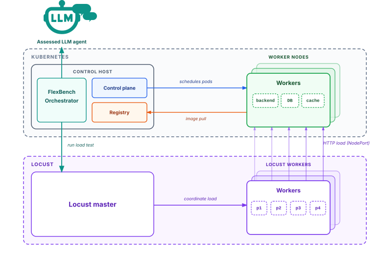
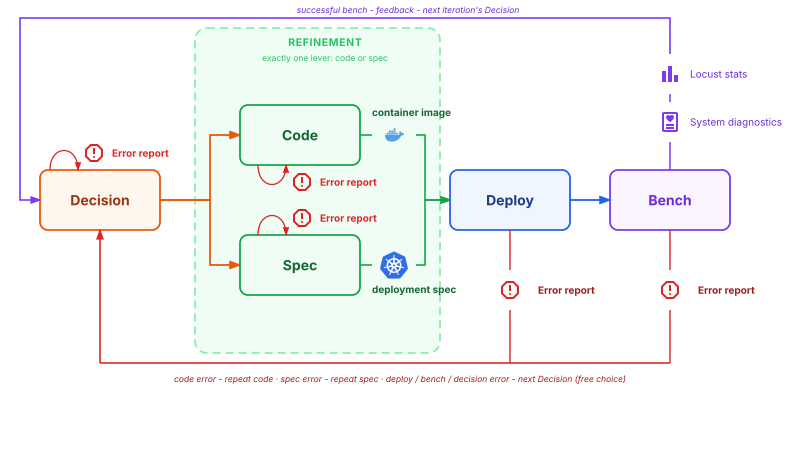
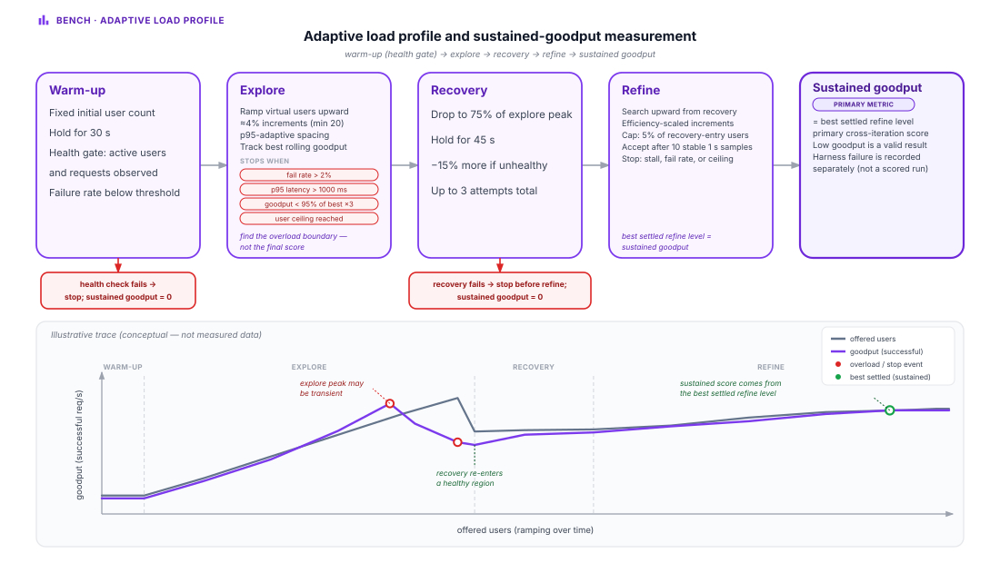
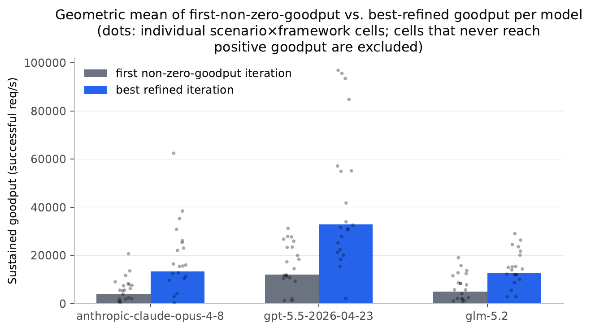
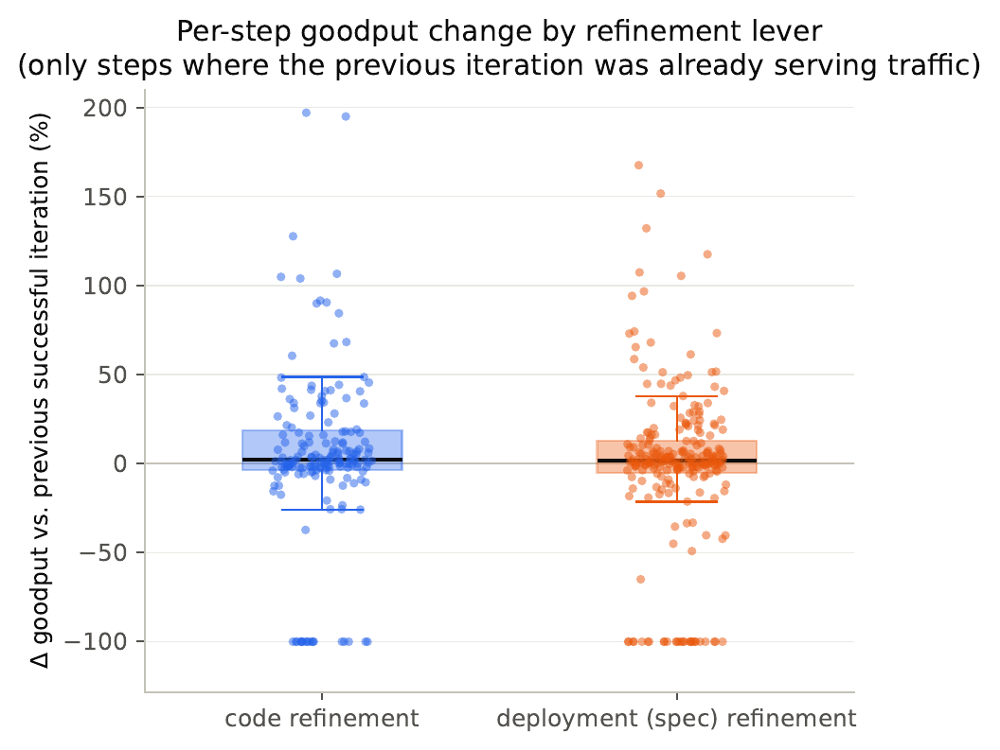
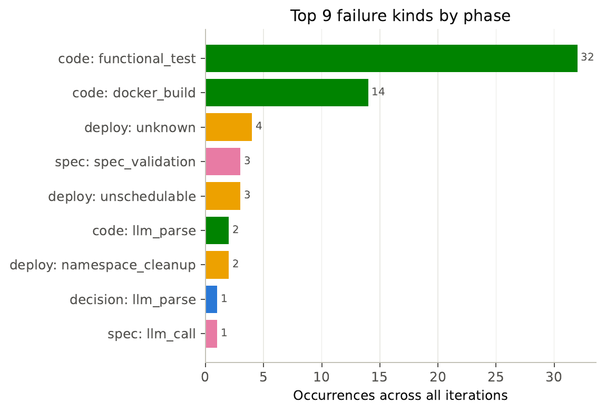
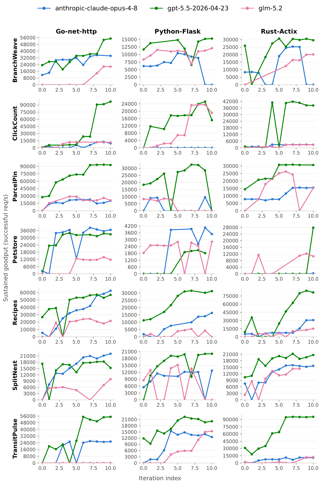
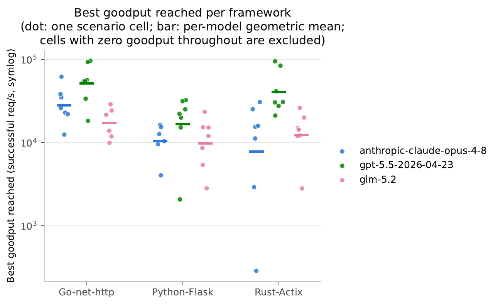

# Iterative Performance Optimization for LLM-Generated Backends

**Talk length:** 14:40 minutes + 20 seconds of reserve  
**Audience:** Professor and research/student group  
**Purpose:** Explain why functional correctness alone is insufficient for production readiness, how the thesis extends BaxBench, and what the evaluation shows.

## Core message

> Functionally correct LLM-generated code is not necessarily production-ready. Under fixed Kubernetes constraints, feedback-guided iterative refinement can improve sustained goodput, but code correctness remains the dominant bottleneck and deployment tuning has real downside risk.

## Delivery rules

- Use the slide title as the takeaway; do not add a separate agenda slide.
- Keep the visible text to one claim, one number, or one question per slide.
- Reveal the visual first, pause, then explain what the audience should notice.
- Use the existing colour language consistently: green for successful performance, purple for measurement/feedback, orange for agent intervention, and red only for failures or risk.
- The words below are a talk track, not text to put on the slides.

---

## Slide 1 — Title

**Time:** 00:00–00:20

**Visible slide content**

- Official thesis title
- Your name, affiliation, supervisor, date

**Talk track**

> Good [morning/afternoon]. In this thesis, I investigate whether an LLM agent can do more than generate a backend application: can it iteratively improve how that application performs once it is deployed on a real Kubernetes cluster?

**Animation/build**

No animation. Keep the opening calm and minimal.

---

## Slide 2 — Correct code can still fail in production

**Time:** 00:20–01:30

**Visible slide content**

`Functional tests pass` → `Production deployment under load` → `Can it sustain traffic?`

Use a simple, custom three-part visual: a single container with a green checkmark, then a Kubernetes deployment with replicas, a database and a pooler, then a red question mark around sustained goodput.

**Talk track**

> Consider a backend that passes its API tests. In a conventional benchmark, that is a success. But a production backend is not an isolated container. It runs with replicas, resource limits, placement decisions, a database, and often a connection pooler.
>
> A functionally correct application can therefore still fail to sustain useful traffic under real load. The question of this thesis starts exactly at that gap between code correctness and production readiness.

**Animation/build**

1. Show only `Functional tests pass`.
2. Reveal the cluster components.
3. Reveal `Can it sustain traffic?` and pause before continuing.

---

## Slide 3 — Existing systems provide the task; this thesis adds runtime optimisation

**Time:** 01:30–02:35

**Visible slide content**

Show three connected stages, not a detailed process diagram:

`AutoBaxBuilder` → `BaxBench` → `This thesis`

- **AutoBaxBuilder:** scenario, API contract, tests, workload
- **BaxBench:** generate and validate backend code
- **This thesis:** Kubernetes, adaptive load testing, iterative code/spec refinement

**Talk track**

> This work builds on two existing foundations. AutoBaxBuilder constructs scenarios, API contracts, tests, and validated workloads. BaxBench then evaluates whether models can generate a backend that satisfies the required functionality and security checks.
>
> My contribution begins after that point. I extend the evaluation with a real Kubernetes deployment, adaptive load testing, and an iterative feedback loop that can refine either the application code or its deployment specification.

**Important precision**

> BaxBench includes security testing. This performance evaluation carries forward functional testing, while re-integrating security checks into the iterative performance loop is future work.

**Animation/build**

Reveal the three stages from left to right. The final stage should be the visual focus.

---

## Slide 4 — Research question and concrete contribution

**Time:** 02:35–03:35

**Visible slide content**

> Can an LLM agent iteratively optimise the deployment configuration of a backend application on Kubernetes, using runtime feedback to maximise sustained goodput under fixed infrastructure constraints?

Below the question, show a small loop:

`Agent` → `Code or deployment spec` → `Cluster feedback` → `Agent`

Add one constraint beneath the loop:

> One optimisation lever per iteration

**Talk track**

> The key word here is *iteratively*. The agent does not receive a target configuration or a recommended resource range. It receives measured feedback and decides what to change next.
>
> The framework deliberately changes only one lever per iteration: either code or deployment specification. This makes improvements and regressions much more attributable than if both were changed at once.

**Animation/build**

Reveal the research question first, then the feedback loop, then the one-lever constraint.

---

## Slide 5 — The benchmark separates reasoning, deployment, and measurement

**Time:** 03:35–04:35

**Figure to show**

*Source: `DiagramCreation/export/methods/benchmark-architecture/architecture.svg`*

**Visible slide content**

Use the figure with three labelled highlights:

- Agent and orchestrator
- Kubernetes worker nodes
- Separate Locust load-generation hosts

**Talk track**

> This architecture keeps the optimisation agent, the system under test, and the load generator distinct. The orchestrator handles deployment and evaluation. Kubernetes worker nodes run the candidate backend, database, pooler, and optional cache. Dedicated Locust hosts generate load separately, so load-generation CPU does not contaminate the performance measurement.

> This separation makes the feedback meaningful: a change is evaluated against the deployed system, rather than against the benchmark runner itself.

**Animation/build**

Reveal the three regions in this order: agent/orchestrator, cluster, then Locust. Dim all other regions while discussing each one.

**Check before presenting**

The current SVG says **“FlexBench Orchestrator”**, while the thesis consistently refers to the **BaxBench orchestrator**. Rename that label before using this figure in the final deck.

---

## Slide 6 — Every iteration changes one artefact and measures the result

**Time:** 04:35–05:55

**Figure to show**

*Source: `DiagramCreation/export/methods/iteration-protocol-and-stage-contracts/iteration-workflow.svg`*

**Visible slide content**

Show only the main path prominently:

`Decision` → `Code OR Spec` → `Deploy` → `Bench` → `Feedback`

Keep error-routing arrows faint or remove them from the slide version.

**Talk track**

> A baseline generates both application code and a deployment specification. Afterwards, each refinement iteration begins with the previous benchmark outcome.
>
> The agent chooses whether the likely bottleneck is in the code or in the deployment configuration. The selected artefact is regenerated and validated; the other valid artefact is carried forward. The candidate is then deployed, benchmarked, and the resulting diagnostics are fed into the next decision.

> This is also where the framework protects the trajectory: failed code or spec proposals do not silently overwrite the last valid artefact.

**Animation/build**

Build the process one click at a time: `Decision` → `Code/Spec` → `Deploy` → `Bench` → the feedback arrow returning to `Decision`.

---

## Slide 7 — The score is sustainable success, not a transient peak

**Time:** 05:55–07:05

**Figure to show**

*Source: `DiagramCreation/export/methods/load-benchmark/adaptive-load-profile.svg`*

**Visible slide content**

Keep the lower curve large. At the top, retain only:

`Warm-up` → `Explore` → `Recovery` → `Refine` → `Sustained goodput`

Highlight the final green point.

**Talk track**

> The objective is sustained goodput: the best settled rate of successful HTTP responses. It is not simply the highest request rate reached for a few seconds.
>
> The load profile first explores the overload boundary, then returns to a healthier region and refines the search. This lets the benchmark compare different deployments without manually choosing a request rate for each scenario.

**Animation/build**

Reveal each phase of the curve from left to right. Reveal the green sustained-goodput point last and say: “This is the score used to compare iterations.”

---

## Slide 8 — The evaluation covers 63 complete trajectories

**Time:** 07:05–08:05

**Visible slide content**

Put this equation in the centre of the slide:

> **3 models × 7 scenarios × 3 frameworks = 63 cells**

Below it, use a quiet footer:

`10 refinement iterations` · `one sample per cell` · `fixed 9-host cluster`

**Talk track**

> I evaluate three frontier-tier models across seven database-backed BaxBench scenarios and three application frameworks: Go-net-http, Python-Flask, and Rust-Actix.
>
> Every cell receives a ten-iteration budget. All 63 cells establish validated baselines and complete the full refinement budget. However, there is one sample per cell, so the comparisons are descriptive rather than statistically tested.

**Animation/build**

Reveal the equation in three steps, then reveal the limitations footer last.

---

## Slide 9 — Iteration improves goodput and often rescues zero-goodput baselines

**Time:** 08:05–09:40

**Figure to show**

*Source: `Writeup/figures/eval/baseline_vs_best_by_model.pdf`*

**Visible slide content**

Use the chart with a short title:

> Iterative refinement improves the best sustained goodput

Add these three callouts:

- `Claude: 3.3×`
- `GPT-5.5: 2.7×`
- `GLM-5.2: 2.5×`

And one large lower-third statement:

> **27 of 29 initial zero-goodput baselines recover**

**Talk track**

> Across all models, the best refined iteration is substantially above the first iteration with positive goodput. The aggregate gains are between 2.5 and 3.3 times, but the more important finding is not only tuning an already healthy system.
>
> Twenty-nine baselines start with zero sustained goodput. Twenty-seven of them later reach a non-zero, benchmarkable deployment. In many cases, the feedback loop changes an initially non-sustainable deployment into one that can serve traffic under load.

> I interpret this carefully: zero sustained goodput can result from a failed warm-up or recovery stage, not necessarily from an application that never served any request.

**Animation/build**

Show the grey baseline bars first. Reveal the blue best-iteration bars second. Reveal `27 of 29` only after the audience has seen the contrast.

---

## Slide 10 — Code fixes the largest failures; deployment tuning is useful but riskier

**Time:** 09:40–11:05

**Primary figure to show**

*Source: `Writeup/figures/eval/code_vs_spec_delta.pdf`*

**Supporting figure — use as a small callout or a backup slide**

*Source: `Writeup/figures/eval/failure_taxonomy.pdf`*

**Visible slide content**

Use the box plot as the main visual and add only two short annotations:

- **Code:** fixes correctness-adjacent bottlenecks
- **Deployment spec:** capacity tuning with occasional backfires

Small callout:

> 46 / 62 recorded failures are functional-test or build failures

**Talk track**

> The two refinement levers specialise. Code refinement produces the largest single-step recoveries, because it can fix correctness and connection-handling defects that no replica count can solve.
>
> Deployment refinement acts as a smaller capacity knob. It is positive on average for two models, but it can also regress a healthy deployment. For GLM-5.2, its average deployment-spec step is negative in this dataset.

> This supports separating the levers in the framework. It also reveals a stronger message: 74 percent of recorded failures are functional-test or build failures. Correctness remains the main gate to performance.

**Animation/build**

Reveal the code side of the plot and its annotation first. Reveal the deployment side second. Reveal the `46 / 62` callout last.

---

## Slide 11 — The agent can converge to workload-appropriate deployment choices

**Time:** 11:05–12:25

**Figure to reference**

*Source: `Writeup/figures/eval/goodput_trajectories_grid.pdf`*

**Visible slide content**

Do **not** show the complete grid in the final slide. Crop it to the `ClickCount × Go-net-http` panel for GPT-5.5, then show this visual transformation beside it:

`48 × 1000m pods` → `320 × 250m pods`  
`3 DB replicas` → `1 DB replica`  
`1,285 req/s` → `96,925 req/s`

**Talk track**

> A detailed ClickCount trajectory shows what useful convergence looks like. ClickCount is close to stateless and relatively light per request. The agent moves from a few large backend pods to many smaller replicas, while reducing unnecessary database replication.
>
> Goodput increases from about 1,300 to almost 97,000 successful requests per second. GLM-5.2 reaches the same qualitative configuration direction on the same workload. This is evidence that the agent is responding to workload feedback rather than merely applying a fixed default.

**Animation/build**

Reveal baseline configuration, then the final configuration, then the goodput change. Let the trajectory curve appear in the background only after the configuration change is understood.

---

## Slide 12 — Models complete equally; throughput and cost still differ

**Time:** 12:25–13:25

**Visible slide content**

Use three labelled points in a simple scatter plot: horizontal axis = cost per cell, vertical axis = best geometric-mean goodput.

| Model | Best goodput | Cost per cell |
|---|---:|---:|
| GPT-5.5 | 32,816.6 req/s | $6.87 |
| Claude Opus 4.8 | 13,381.7 req/s | $6.35 |
| GLM-5.2 | 12,630.1 req/s | $1.36 |

Small heading:

> All three models complete all 21 cells

**Talk track**

> Completion rate does not separate the three models in this evaluation: all three complete their 21 cells. The useful difference is outcome versus cost.
>
> GPT-5.5 reaches the highest absolute goodput without proportionally higher cost than Claude. GLM-5.2 reaches a similar goodput to Claude at roughly one fifth of the cost. Framework choice also matters: Go-net-http reaches the highest geometric-mean goodput for every model.

**Animation/build**

Reveal the completion statement, then the three points one at a time. Do not animate the table; it is speaker reference only and should become a scatter plot in the final deck.

---

## Slide 13 — Yes, within the tested scope

**Time:** 13:25–14:40

**Visible slide content**

Centre:

> **Yes — feedback-guided iteration can improve sustained goodput.**

Left, in grey:

`7 database-backed scenarios` · `one cluster topology` · `n = 1` · `10 iterations`

Right, in the accent colour:

`broader bottleneck types` · `repeated samples` · `multi-metric objective` · `safer spec changes and rollback` · `security in the loop`

**Talk track**

> To answer the research question: yes, within the scope tested here. An LLM agent can use runtime feedback to improve sustained goodput under fixed cluster constraints, and it can often recover deployments that start with zero sustained goodput.
>
> But deployment optimisation is not a substitute for correctness. The dominant bottleneck remains code correctness, and unconstrained multi-field deployment changes can backfire. The next step is therefore not simply more tuning iterations: it is broader workloads, repeated samples, safer change policies, richer objectives, and security checks inside the loop.

> Thank you — I am happy to discuss the design choices and the trajectories in more detail.

**Animation/build**

Reveal the answer first. Reveal the limitations second. Reveal future work last, while delivering the final sentence.

---

# Backup slides

Use these only if asked; do not include them in the 15-minute path.

## Framework comparison

*Source: `Writeup/figures/eval/framework_comparison.pdf`*

**Answer if asked:** Go-net-http establishes the highest geometric-mean goodput ceiling for every model. The lowest framework is model-dependent, partly because individual trajectories can collapse or stall early.

## Failure taxonomy

**Answer if asked:** 32 functional-test failures and 14 docker-build failures account for 46 of 62 recorded failures. This is why the main talk frames code correctness as the principal performance gate.

## Full trajectory grid

**Answer if asked:** The full grid shows that gains are non-monotonic. In particular, a fixed ten-iteration budget can end a trajectory just after a late regression, before the agent has a chance to recover.

---

# Animation guidance for the SVG figures

Markdown renders the SVGs as **static images**. The animation happens in the eventual presentation tool, not in this file.

## Recommended approach: progressive builds

For this talk, use 3–5 deliberate builds per slide rather than continuous animation. Progressive builds keep a scientific presentation calm and let you control the explanation.

1. Duplicate the slide or duplicate the SVG image for each state.
2. In each later state, dim, crop, or reveal exactly one additional region.
3. Use a short `Appear` or `Fade` transition on click.
4. Avoid motion paths, spinning, or automatic animation: they are distracting and make technical diagrams harder to inspect.

This works reliably in PowerPoint, Google Slides, and Keynote.

## If you use PowerPoint

1. Insert the SVG.
2. For a simple reveal, keep it as one image and use overlay rectangles to dim everything except the current region.
3. For true part-by-part animation, duplicate the SVG and make a separate cropped copy for each region you want to reveal. This is more reliable than trying to animate the SVG internals.
4. If needed, use **Convert to Shape** and then ungroup the SVG. Only do this on a copy: complex SVGs can produce many small shapes and may lose editability or visual fidelity.

## If you use Google Slides

Google Slides treats an SVG as a single image; it cannot reliably animate its internal elements. Use separate cropped SVG/PNG copies on top of one another, then animate each image with `Fade in` on click.

## If you present in a browser

You can animate SVG groups with CSS or SMIL if the SVG contains stable `id` attributes for its groups. This is suitable for an HTML talk, but it is not portable to PowerPoint, PDF export, or Google Slides. For a thesis presentation, progressive image states are the safer choice.

## Suggested build order by figure

| Figure | Build sequence |
|---|---|
| Architecture | Agent/orchestrator → cluster workers → separate Locust hosts |
| Iteration workflow | Decision → Code/Spec choice → Deploy → Bench → feedback arrow |
| Adaptive load profile | Explore overload → recovery → refine → sustained-goodput point |
| Baseline vs. best | Grey baseline bars → blue best bars → 27/29 recovery callout |
| Code vs. spec | Code distribution → spec distribution → correctness-failure callout |
| ClickCount case | Baseline config → final config → goodput jump → cropped trajectory |
